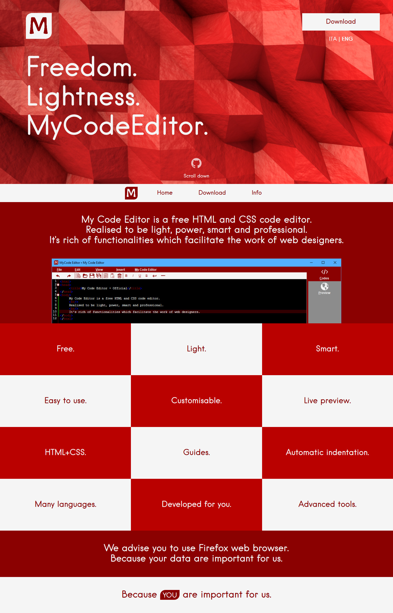

# My Code Editor
  

My Code Editor era un software sviluppato per puro hobby da Saverio Morelli; è scritto in VB .NET. Inizialmente si chiamava *Minion One*.

Lo scopo del software era quello di permettere di sviluppare un sito web, quindi in HTML/CSS, in maniera veloce e con strumenti potenti e utili.

Lo sviluppo effettivo del software è terminato nel 2015. Precedentemente il codice sorgente non era disponibile su Github, ma solamente sul sito web dedicato (*non più esistente*).

L’icon del software è stata modificata molte volte, in base alla versione (in basso la lista completa). Lo slogan era “L’editor di tutti”

La licenza utilizzata è la CC BY-ND-NC 4.0 Int.

Il software poteva essere installato su sistema operativo Windows (da Vista in poi)  e con Microsoft Framework 4.5+.

Si prega di non aprire issue in questo repository, poiché lo sviluppo è terminato. Per qualunque informazioni, contattare `@Sav22999` su Telegram.

A fine 2017 era iniziato lo sviluppo di una nuova e moderna versione, direttamente nel web browser. Tuttavia è rimasta in versione Alpha senza prendere mai vita effettiva al grande pubblico. Screenshot della versione Alpha 0.2 Web in fondo.

*Il codice del software è veramente poco chiaro, privo di commenti, strutturato in maniera errata. L’ho sviluppato quando avevo 12 anni, fino a quando ne avevo 15-16 circa.*

*Il software, inizialmente, veniva firmato da autore <u>Ret Minion</u>, successivamente <u>MixiM</u> e, infine, con il nome effettivo Saverio Morelli.*

## Icone

Release: Alpha </img>

-----------------------
Release: 1.0+ </img>

-----------------------
Release: 2.0+ </img>

-----------------------
Release: 4.0+ </img>

-----------------------
Release: 5.0+ </img>

-----------------------

## Screenshot sito web

Il sito web è ormai chiuso; questo è uno screenshots dell’ultima versione pubblicata del sito web.

</img>

## Screenshot versione Web

Questa era la versione web (release 0.2alpha).

</img>